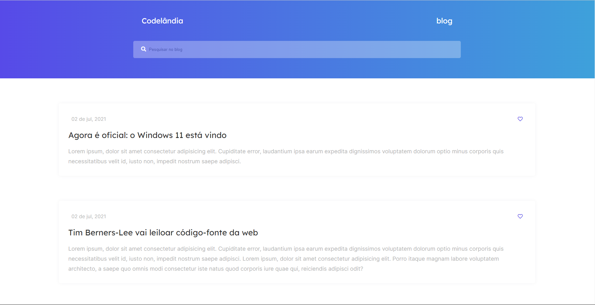
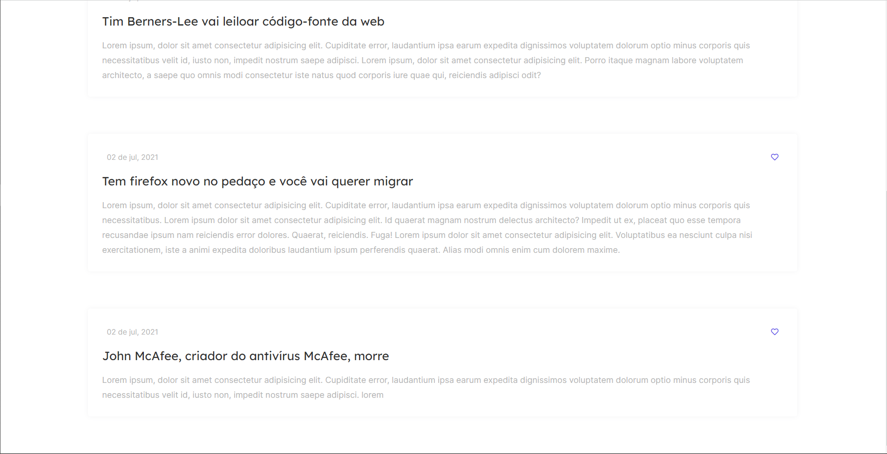

# Codelândia Blog

> The blog codelândia project is part of the first challenge proposed by Iuri on his discord channel. The challenge aims to fix the learned concepts of HTML, CSS, flexbox and responsivity.

<br/>

# How to execute

## Step 1

Clone the repository.
```
https://github.com/LivHelen12/blog-codelandia.git
```

## Step 2

This step is optional, if you are using VS Code, I recommend installing the Live Server extension.

## Step 3

Open the index.html in your browser.

<br/>

# Result



